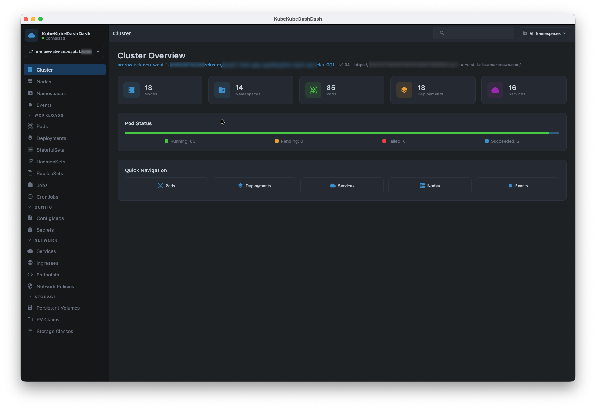

# KubeKubeDashDash

A desktop Kubernetes cluster dashboard built with Jetpack Compose Multiplatform. It connects to clusters through your local kubeconfig and provides a read-oriented interface for browsing resources, viewing YAML, and streaming pod logs.



## Features

### Cluster management

- Switch between kubeconfig contexts from the sidebar
- Filter all views by namespace or browse across all namespaces
- Cluster overview with pod status breakdown, node count, and namespace count

### Resource browsing

Supported resource types:

| Category | Resources |
|----------|-----------|
| Cluster | Nodes, Namespaces, Events |
| Workloads | Pods, Deployments, StatefulSets, DaemonSets, ReplicaSets, Jobs, CronJobs |
| Config | ConfigMaps, Secrets |
| Network | Services, Ingresses, Endpoints, Network Policies |
| Storage | PersistentVolumes, PersistentVolumeClaims, StorageClasses |

All resource lists are presented in sortable tables with auto-refresh (every 5 seconds for most resources, 10 seconds for cluster-level views).

### Resource details

- Side panel with Overview and YAML tabs for inspected resources
- YAML view with syntax highlighting and line numbers
- Labels and annotations displayed as chips

### Node details

- Detail panel with Overview, Pods, Events, and YAML tabs
- Lists pods scheduled on the selected node with click-to-navigate to the Pods screen
- Node events tab for warnings and errors
- Cluster-wide CPU/memory stats panel with usage history sparklines

### Deployment details

- Resource graph tab that visualizes the ownership chain (Deployment → ReplicaSet → Pods) along with related Services, Ingresses, ConfigMaps, Secrets, and HPAs

### Pod details

- Detail panel with Overview, YAML, and Logs tabs
- Container picker for multi-container pods
- CPU and memory usage gauges when a Metrics Server is installed
- Log viewer with text filtering, follow mode, line wrapping, and copy to clipboard
- Selectable text in both pod logs and application logs (click-drag to select, Cmd/Ctrl+C to copy)

### Delete operations

Deletion is supported for Pods, Deployments, Services, ConfigMaps, Secrets, Jobs, and CronJobs. There is no create or update functionality.

### Startup prerequisites check

On launch the application verifies that the required tools are available before presenting the cluster selector:

- **Kubeconfig** — checks that `~/.kube/config` (or `$KUBECONFIG`) exists and is readable
- **Cluster contexts** — ensures at least one context is defined
- **Cloud CLI tools** — checks for `aws`, `gcloud`, or `kubelogin`/`az` only when the kubeconfig contains EKS, GKE, or AKS contexts respectively

If all checks pass the modal is dismissed automatically. If any required check fails, the user can choose to quit or ignore the warning and continue.

### UI

- Dark theme (Material 3)
- Resizable detail panels that auto-adapt to available space
- Cross-resource navigation (e.g. node → pod)
- Status badges with color coding (Running, Pending, Failed, etc.)

## Prerequisites

- **JDK 21** or later (only for building from source; the packaged DMG/MSI/DEB bundles its own JVM)
- A valid `~/.kube/config` with at least one accessible cluster
- **AWS CLI** — required when connecting to EKS clusters (`aws eks get-token`)
- **Google Cloud SDK** — required when connecting to GKE clusters
- **Azure kubelogin** or **Azure CLI** — required when connecting to AKS clusters
- **Metrics Server** (optional) — required for CPU/memory usage data on the Pods screen

The application checks for these at startup and reports any missing prerequisites.

## Running

```bash
./gradlew :composeApp:run
```

The application opens a 1440×900 window, runs a prerequisites check, and presents the cluster selector.

## Building distributable packages

```bash
# macOS
./gradlew :composeApp:packageDmg

# Windows
./gradlew :composeApp:packageMsi

# Linux
./gradlew :composeApp:packageDeb
```

## Tech stack

| Component | Library / Version |
|-----------|-------------------|
| Language | Kotlin 2.2.0 |
| UI framework | Compose Multiplatform 1.10.0 |
| Kubernetes client | fabric8 kubernetes-client 7.5.2 |
| Coroutines | kotlinx-coroutines 1.10.1 |
| Serialization | kotlinx-serialization 1.8.0 |
| Date/time | kotlinx-datetime 0.7.0 |
| Logging | Logback Classic 1.5.x (via SLF4J) |
| Build tool | Gradle 8.12 |

## CI

A GitHub Actions workflow builds distributable packages (DMG, DEB, MSI) on every push and PR to `main`. Pushing a `v*` tag creates a GitHub Release with the built artifacts.

## macOS packaged app notes

When launched from a DMG-installed `.app` bundle, macOS GUI apps inherit a minimal `PATH` that does not include user-installed tools. KubeKubeDashDash automatically resolves the full `PATH` from the user's login shell at startup so that kubeconfig exec plugins (e.g. `aws eks get-token`) work correctly.

## Limitations

- Desktop only (no web or mobile targets)
- No RBAC-aware UI — errors from insufficient permissions are shown as-is
- No resource creation or editing
- Metrics require a running Metrics Server in the cluster
- Log streaming relies on fabric8's `watchLog` and may not handle all edge cases (e.g., very large log volumes)

## License

MIT
