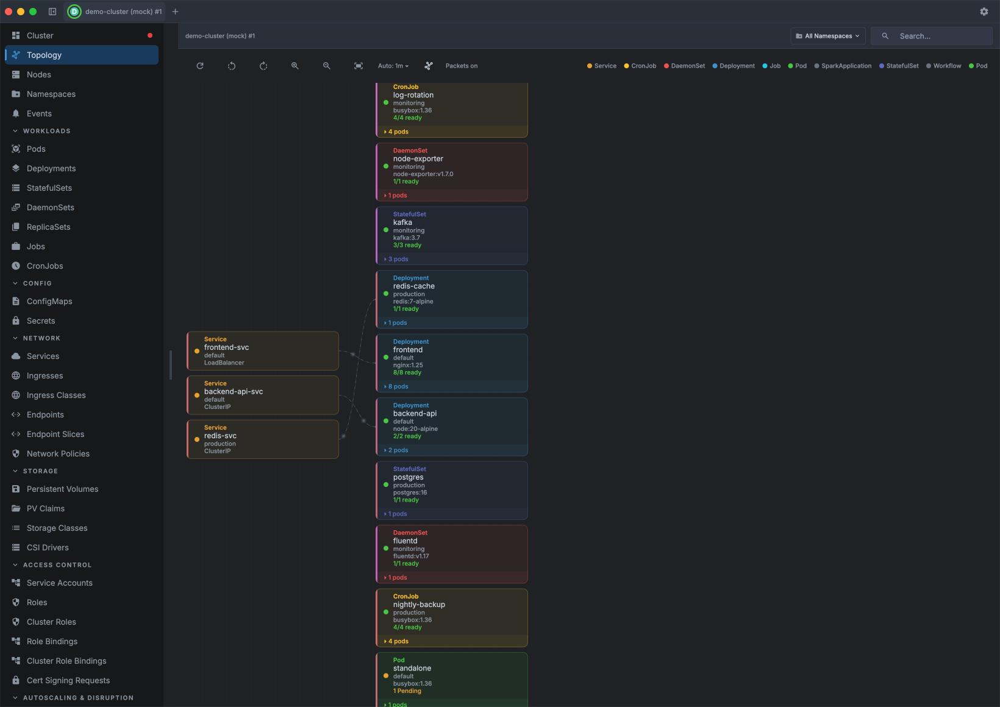

# KubeKubeDashDash

A desktop Kubernetes dashboard built with Compose Multiplatform. It connects to your clusters through your local kubeconfig and lets you browse resources — across several clusters at once — inspect YAML, stream logs, open an interactive shell into a pod, visualize cluster topology, and run common operational actions (scale, restart, cordon, drain, evict, trigger, approve…) without hand-writing kubectl commands.

It stays a browse-and-operate tool rather than an authoring tool: there is no blanket resource creation or free-form YAML editing — writes are limited to the targeted actions listed below.


## Features

### Cluster management

- Switch between kubeconfig contexts from the sidebar or the command palette
- Filter all views by namespace or browse across all namespaces
- Cluster overview with a health banner, pod status breakdown, node count, and namespace count
- A liveness probe detects silent disconnects and reflects connection state in the tab

### Multi-cluster workspaces

- **Tab strip** — each tab shows a color-coded cluster chip with a live connection-status ring: a rotating arc while connecting, a pulsing red ring when disconnected, and a solid ring when healthy
- **Multiple windows** — open additional OS windows, each running as an independent workspace with its own tab strip, navigation state, and selected namespace
- Tabs and windows are fully isolated — scrolling, selection, and navigation do not bleed across
- Per-cluster colors are assigned automatically and can be overridden in Settings

### All Clusters view

A dedicated tab (alongside your per-cluster tabs) that aggregates everything you have open into one screen:

- **Combined statistics** — pod-phase breakdown, aggregated CPU/memory usage with history sparklines, pod-count gauges, and top nodes across every connected cluster
- **Cluster summary cards** — sorted by recent error count, with inline issue badges; click a card to activate that cluster's tab (in this window or another)
- **Event triage** — a filterable event stream spanning all clusters; filter by cluster, namespace, reason, and type, save and reapply filter presets, group related events, and toggle a reason **heatmap** across clusters

### Cluster topology

A whole-cluster graph that visualizes how resources relate, with workload cards, a dedicated pod column, and animated "packets" flowing along connections.



- Columns are pyramid-arranged by upstream connection count, and the viewport centers on the graph on landing
- Viewport controls: **zoom** in/out, **pan** (drag), **rotate** the flow direction through four orientations, and **fit to screen**
- Click a node to highlight the entire connected pipe
- Configurable **auto-refresh** (Off / 5s / 15s / 30s / 60s / 2m / 5m, default 60s), paused automatically when you leave the screen
- Namespace selector, a dynamic legend of the kinds in view, and an optional packet-animation toggle
- Custom resources group their owned pods under the CRD root

### Resource browsing

Supported resource types:

| Category | Resources |
|----------|-----------|
| Cluster | Nodes, Namespaces, Events |
| Workloads | Pods, Deployments, StatefulSets, DaemonSets, ReplicaSets, Jobs, CronJobs |
| Config | ConfigMaps, Secrets |
| Network | Services, Ingresses, IngressClasses, Endpoints, EndpointSlices, Network Policies |
| Storage | PersistentVolumes, PersistentVolumeClaims, StorageClasses, CSIDrivers |
| Access Control (RBAC) | ServiceAccounts, Roles, ClusterRoles, RoleBindings, ClusterRoleBindings, CertificateSigningRequests |
| Autoscaling & Disruption | HorizontalPodAutoscalers, PodDisruptionBudgets |
| Governance | ResourceQuotas, LimitRanges, PriorityClasses |
| Admission | ValidatingWebhookConfigurations, MutatingWebhookConfigurations |
| Custom | Any CRD discovered on the cluster (see below) |

Lists are sortable tables that refresh automatically (live via Kubernetes watch/informers where available, otherwise polled). They support keyboard navigation (arrow keys, Home/End to jump), show the full value on hover when a cell is truncated, format large counts with thousands separators, and — on the Pods screen — let you pin rows to the top.

### Custom resources (CRDs)

- CRDs are **discovered automatically** when you connect and listed in a dedicated **Custom Resources** sidebar section, searchable and grouped by API group
- **Per-cluster pin/hide** preferences persist across sessions (right-click a CRD to pin or hide it)
- Custom resources render through the same generic table and detail UI, appear in the command palette, and group under their owner in the topology graph

### Command palette (⌘K)

Press <kbd>⌘K</kbd> / <kbd>Ctrl+K</kbd> for a fuzzy finder (subsequence scoring) that jumps to any screen, switches between open clusters, or navigates to a namespace, a cached pod, a node, or a discovered CRD.

### Resource details

- Side panel with **Overview** and **YAML** tabs for inspected resources
- YAML view with syntax highlighting, line numbers, and copy-to-clipboard (read-only)
- Labels and annotations shown as chips; click a chip to toggle it into the active label/annotation filter
- Many kinds have resource-specific detail tabs — e.g. RBAC Roles show their resolved rules and bindings, ResourceQuotas show usage bars, EndpointSlices link through to their backing Service, and CertificateSigningRequests expose Approve/Deny

### Node details

- Detail panel with Overview, Pods, Events, and YAML tabs
- Lists pods scheduled on the selected node with click-to-navigate to the Pods screen
- Node events tab for warnings and errors
- Cluster-wide CPU/memory stats panel with usage-history sparklines
- **Cordon / Uncordon** and **Drain** actions (Drain cordons the node, then evicts only the pods actually scheduled on it, skipping DaemonSet-owned and static/mirror pods and already-terminated pods)

### Deployment details

- Resource graph tab that visualizes the ownership chain (Deployment → ReplicaSet → Pods) along with related Services, Ingresses, ConfigMaps, Secrets, and HPAs
- **Scale** and **Rollout Restart** actions

### Pod details

- Overview and YAML views, with a container picker for multi-container pods
- CPU and memory usage gauges when a Metrics Server is installed
- One-click **View logs** (streamed into the bottom drawer) and **Open shell** (interactive terminal — see below)
- **Evict**, **Force-Delete**, and **Delete** actions

### Resource actions

Beyond browsing, KubeKubeDashDash can perform a focused set of write operations:

| Resource | Actions |
|----------|---------|
| Pods | View logs, Open shell (exec), Evict, Force-Delete, Delete |
| Nodes | Cordon, Uncordon, Drain |
| Deployments, StatefulSets, ReplicaSets | Scale |
| Deployments, StatefulSets, DaemonSets | Rollout Restart |
| CronJobs | Trigger Now, Suspend, Resume |
| CertificateSigningRequests | Approve, Deny |
| Most other kinds + custom resources | Delete |

Delete is available both from a resource's detail-panel header and from a right-click context menu in the lists. Destructive actions go through a confirmation dialog. There is no generic create or YAML-edit capability.

### Pod shell (terminal)

Open an interactive shell into a running container via `kubectl exec` (powered by JediTerm). The shell auto-selects `bash`, falling back to `sh`. The session — including its scrollback — **persists across tab switches**, so navigating away and back does not drop your shell.

### Logs

Pod and application logs share a resizable **bottom drawer**, toggled with <kbd>⌘J</kbd> / <kbd>Ctrl+J</kbd>:

- One tab per streamed pod/container, plus a persistent **Application logs** tab for the app's own diagnostics
- Per-tab **text filter** with the matching substring highlighted in the lines
- Auto-follows the tail as new lines arrive; selectable, copyable text (drag to select, ⌘/Ctrl+C, or copy the visible lines)
- Logs for terminated pods (Succeeded/Failed) are read once as history instead of opening a live stream

### Filtering & search

- **Status filter** — multi-select chip on the Pods, Nodes, and generic resource lists
- **Label** and **annotation** selector chips (`key=value`, comma-separated) shared across screens
- Click a label/annotation chip in a detail panel to toggle it into the filter
- Per-screen text search across the relevant fields, plus a single **Clear** chip when any filter is active

### Startup prerequisites check

On launch the application verifies that the required tools are available before presenting the cluster selector:

- **Kubeconfig** — checks that `~/.kube/config` (or `$KUBECONFIG`) exists and is readable
- **Cluster contexts** — ensures at least one context is defined
- **Cloud CLI tools** — checks for `aws`, `gcloud`, or `kubelogin`/`az` only when the kubeconfig contains EKS, GKE, or AKS contexts respectively

CLIs are re-scanned on each check, so a retry after installing a missing tool succeeds without restarting. If all checks pass the modal is dismissed automatically. If any required check fails, you can quit, ignore the warning and continue, or run **EKS cluster discovery** to populate the kubeconfig from AWS without leaving the app. When no kubeconfig contexts exist at all, the app shows a dedicated first-run welcome screen.

### EKS cluster discovery

A built-in wizard finds EKS clusters in your AWS account and adds them to your kubeconfig. Available from:

- The system check / welcome screen when no kubeconfig is found
- The **Settings** dialog → Cluster discovery → AWS EKS at any time

The flow lets you pick one or more AWS profiles, choose a region scope (default region only, common regions, or all enabled regions), and select which clusters to import; results are grouped by profile. Each import calls `aws eks update-kubeconfig --profile <name>`, which embeds `AWS_PROFILE` into the kubeconfig user exec block — so the profile binding travels with the cluster entry and `aws eks get-token` always uses the right profile at connection time. The bound profile is shown in the cluster selector for every EKS context.

If `~/.kube/config` does not exist, the directory and file are created on demand; an existing config is backed up before clusters are imported. The feature requires the AWS CLI v2 to be installed and on `PATH`.

### Settings

Settings are opened via the gear icon (⚙) in the title bar or <kbd>⌘,</kbd> / <kbd>Ctrl+,</kbd>:

- **Appearance** — Light, Dark, or System (follows OS) theme
- **Cluster colors** — override the auto-assigned color for any cluster, from a preset palette or a custom color
- **Tab behaviour** — when closing the active tab, focus the left neighbor, the first tab, or the most-recently-visited tab; and choose whether the tab strip shows always or only with multiple tabs
- **Integrations → MCP server** — enable/disable the embedded MCP server, set its port (default 3001), restrict it to localhost, require authentication, and copy the generated bearer token
- **Cluster discovery** — AWS EKS wizard
- **Demo cluster simulator** — pause/resume, adjust node and pod count ranges, reset to baseline, or stop the simulator
- **Diagnostics** — open the application log in the bottom drawer
- **About** — version and app details

### MCP server

KubeKubeDashDash embeds an opt-in [Model Context Protocol](https://modelcontextprotocol.io) server so AI assistants and other MCP clients can query your clusters **read-only** over Server-Sent Events (Ktor, default port 3001). Enable it under Settings → Integrations.

- **Resources** — `cluster/overview` and `resource-usage` summaries
- **Tools** — `list_clusters`, `list_resources`, `get_resource_yaml`, and `get_pod_logs`; each can target a specific kube-context when multiple clusters are open
- **Hardening** — binds to localhost by default; optional bearer-token auth (a fresh token each start, compared in constant time); authentication is forced on whenever you bind to the LAN; Origin/Host checks guard against CSRF; and a kind allowlist keeps Secret, ConfigMap, and Node contents out of `get_resource_yaml`

### UI

- Light, Dark, and System (follows OS) themes (Material 3)
- Bundled **Inter** and **JetBrains Mono** fonts for consistent rendering across platforms
- Status badges paired with a glyph so state is legible without relying on color
- Collapsible sidebar — toggle from the title bar; state is persisted across sessions
- macOS window tiling — supports half-screen and other Sonoma tiling arrangements
- Resizable detail panels and a resizable logs drawer; widths/heights persist across tab switches
- Cross-resource navigation (e.g. node → pod) and themed right-click context menus

## Prerequisites

- **JDK 21** or later (only for building from source; the packaged DMG/MSI/DEB bundles its own JVM)
- A valid `~/.kube/config` with at least one accessible cluster
- **AWS CLI** — required when connecting to EKS clusters (`aws eks get-token`)
- **Google Cloud SDK** — required when connecting to GKE clusters
- **Azure kubelogin** or **Azure CLI** — required when connecting to AKS clusters
- **Metrics Server** (optional) — required for CPU/memory usage data on the Pods and Nodes screens

The application checks for these at startup and reports any missing prerequisites.

## Demo cluster

If you don't have a Kubernetes cluster handy, the application ships with a built-in demo cluster simulator. Select **Demo Cluster** in the cluster picker to explore every screen with synthetic resources — nodes, pods, deployments, jobs, seeded CRDs (e.g. Spark and Argo), live-updating metrics, and a steady trickle of events. Each Demo Cluster pick gets its own independent mock instance, and the simulator can be paused, scaled, reset, and stopped from Settings → Demo cluster simulator.

## Keyboard shortcuts

| Shortcut | Action |
|----------|--------|
| <kbd>⌘K</kbd> / <kbd>Ctrl+K</kbd> | Open the command palette |
| <kbd>⌘J</kbd> / <kbd>Ctrl+J</kbd> | Toggle the logs drawer |
| <kbd>⌘,</kbd> / <kbd>Ctrl+,</kbd> | Open Settings |

## Running

```bash
./gradlew :composeApp:run
```

The application opens a 1440×900 window, runs a prerequisites check, and presents the cluster selector.

## Building distributable packages

```bash
# macOS
./gradlew :composeApp:packageDmg

# Windows
./gradlew :composeApp:packageMsi

# Linux
./gradlew :composeApp:packageDeb
```

## Tech stack

| Component | Library / Version |
|-----------|-------------------|
| Language | Kotlin 2.3.21 |
| UI framework | Compose Multiplatform 1.11.1 |
| Material 3 | compose-material3 1.11.0-alpha07, material3-adaptive 1.3.0-alpha07 (ListDetailPaneScaffold) |
| ViewModel / lifecycle | androidx.lifecycle 2.11.0-beta01 (multiplatform) |
| Persistence | androidx.datastore-preferences 1.1.7 |
| Kubernetes client | fabric8 kubernetes-client + kubernetes-server-mock 7.5.2 |
| Terminal | JediTerm 3.64 (interactive pod exec) |
| Coroutines | kotlinx-coroutines 1.10.1 (core + swing) |
| Serialization | kotlinx-serialization 1.8.0 |
| Date/time | kotlinx-datetime 0.7.0 |
| JSONPath | json-path 2.9.0 (custom-resource column extraction) |
| MCP server | modelcontextprotocol kotlin-sdk 0.8.3 |
| Embedded HTTP server | Ktor 3.1.3 (CIO + SSE + content negotiation) |
| Native interop | JNA 5.15 (macOS shell `PATH` resolution) |
| Logging | Logback Classic 1.5.15 (via SLF4J) |
| Code formatting | Spotless 8.7.0 + ktlint |
| Build tool | Gradle 9.3.0, JDK 21 |
| Screenshot generation | `./gradlew generateScreenshots` — drives the live app via `WorkspaceManager` and captures every screen with `java.awt.Robot` |

## CI

A GitHub Actions workflow runs the desktop test suite and builds distributable packages (DMG, DEB, MSI) on every push and PR to `main`. Pushing a `v*` tag creates a GitHub Release with the built artifacts.

## macOS packaged app notes

When launched from a DMG-installed `.app` bundle, macOS GUI apps inherit a minimal `PATH` that does not include user-installed tools. KubeKubeDashDash automatically resolves the full `PATH` from the user's login shell at startup and injects it into the JVM environment so that kubeconfig exec plugins (e.g. `aws eks get-token`) work correctly.

## Limitations

- Desktop only (no web or mobile targets)
- No RBAC-aware UI — errors from insufficient permissions are shown as-is
- No blanket resource creation or free-form YAML editing — YAML is read-only, and writes are limited to the targeted actions listed above
- Metrics require a running Metrics Server in the cluster
- Log streaming relies on fabric8's `watchLog` and may not handle all edge cases (e.g., very large log volumes)

## License

MIT
