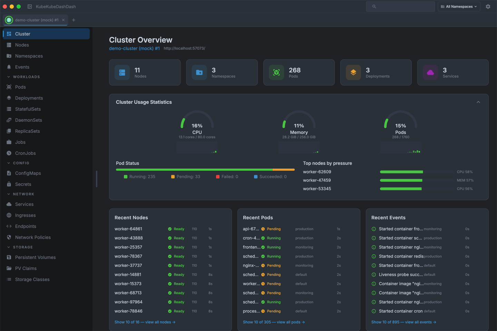
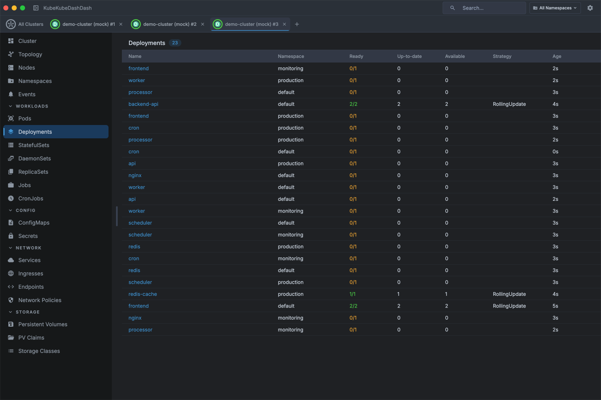

# KubeKubeDashDash

A desktop Kubernetes cluster dashboard built with Jetpack Compose Multiplatform. It connects to clusters through your local kubeconfig and provides a read-oriented interface for browsing resources, viewing YAML, and streaming pod logs.





## Features

### Cluster management

- Switch between kubeconfig contexts from the sidebar
- Filter all views by namespace or browse across all namespaces
- Cluster overview with pod status breakdown, node count, and namespace count
- **Multiple cluster workspaces** — open several clusters at once. Each tab in the window connects to an independent cluster context, and you can open additional windows for side-by-side comparisons. Each workspace maintains its own connection state, selected namespace, and navigation position.

### Multi-cluster workspaces

- **Tab strip** — each tab shows a color-coded cluster chip with a live connection-status ring: a rotating arc while connecting, a pulsing red ring when disconnected, and a solid ring when healthy
- **Multiple windows** — open additional OS windows, each running as an independent workspace with its own tab strip, navigation state, and selected namespace
- Tabs and windows are fully isolated — scrolling, selection, and navigation do not bleed across

### Resource browsing

Supported resource types:

| Category | Resources |
|----------|-----------|
| Cluster | Nodes, Namespaces, Events |
| Workloads | Pods, Deployments, StatefulSets, DaemonSets, ReplicaSets, Jobs, CronJobs |
| Config | ConfigMaps, Secrets |
| Network | Services, Ingresses, Endpoints, Network Policies |
| Storage | PersistentVolumes, PersistentVolumeClaims, StorageClasses |

All resource lists are presented in sortable tables with auto-refresh (every 5 seconds for most resources, 10 seconds for cluster-level views).

### Resource details

- Side panel with Overview and YAML tabs for inspected resources
- YAML view with syntax highlighting and line numbers
- Labels and annotations displayed as chips

### Node details

- Detail panel with Overview, Pods, Events, and YAML tabs
- Lists pods scheduled on the selected node with click-to-navigate to the Pods screen
- Node events tab for warnings and errors
- Cluster-wide CPU/memory stats panel with usage history sparklines

### Deployment details

- Resource graph tab that visualizes the ownership chain (Deployment → ReplicaSet → Pods) along with related Services, Ingresses, ConfigMaps, Secrets, and HPAs

### Pod details

- Detail panel with Overview, YAML, and Logs tabs
- Container picker for multi-container pods
- CPU and memory usage gauges when a Metrics Server is installed
- Log viewer with text filtering, follow mode, line wrapping, and copy to clipboard
- Selectable text in both pod logs and application logs (click-drag to select, Cmd/Ctrl+C to copy)

### Delete operations

Deletion is supported for Pods, Deployments, Services, ConfigMaps, Secrets, Jobs, and CronJobs. There is no create or update functionality.

### Startup prerequisites check

On launch the application verifies that the required tools are available before presenting the cluster selector:

- **Kubeconfig** — checks that `~/.kube/config` (or `$KUBECONFIG`) exists and is readable
- **Cluster contexts** — ensures at least one context is defined
- **Cloud CLI tools** — checks for `aws`, `gcloud`, or `kubelogin`/`az` only when the kubeconfig contains EKS, GKE, or AKS contexts respectively

If all checks pass the modal is dismissed automatically. If any required check fails, the user can choose to quit, ignore the warning and continue, or run **EKS cluster discovery** to populate the kubeconfig from AWS without leaving the app.

### EKS cluster discovery

A built-in wizard finds EKS clusters in your AWS account and adds them to your kubeconfig. Available from:

- The system check modal when no kubeconfig is found (the **Discover EKS Clusters** button)
- The **Settings** dialog (gear icon in the title bar) → Cluster discovery → AWS EKS at any time

The flow lets you pick an AWS profile, choose a region scope (default region only, common regions, or all enabled regions), and select which clusters to import. Each import calls `aws eks update-kubeconfig --profile <name>`, which embeds `AWS_PROFILE` into the kubeconfig user exec block — so the profile binding travels with the cluster entry and `aws eks get-token` always uses the right profile at connection time. The bound profile is shown in the cluster selector for every EKS context.

If `~/.kube/config` does not exist, the directory and file are created on demand. The feature requires the AWS CLI v2 to be installed and on `PATH`.

### Settings

Settings are opened via the gear icon (⚙) in the title bar:

- **Appearance** — Light, Dark, or System (follows OS) theme
- **Tab behaviour** — when closing the active tab, focus moves to the left neighbor, the first tab, or the most-recently-visited tab
- **MCP server** — enable/disable the embedded MCP server and configure its port (default 3001)
- **Cluster discovery** — AWS EKS wizard
- **Demo cluster simulator** — pause/resume, adjust node and pod counts, or stop the simulator
- **Diagnostics** — open the application log file

### UI

- Light, Dark, and System (follows OS) themes (Material 3)
- Collapsible sidebar — toggle from the title bar; state is persisted across sessions
- macOS window tiling — supports half-screen and other Sonoma tiling arrangements
- Resizable detail panels that auto-adapt to available space
- Cross-resource navigation (e.g. node → pod)
- Status badges with color coding (Running, Pending, Failed, etc.)

## Prerequisites

- **JDK 21** or later (only for building from source; the packaged DMG/MSI/DEB bundles its own JVM)
- A valid `~/.kube/config` with at least one accessible cluster
- **AWS CLI** — required when connecting to EKS clusters (`aws eks get-token`)
- **Google Cloud SDK** — required when connecting to GKE clusters
- **Azure kubelogin** or **Azure CLI** — required when connecting to AKS clusters
- **Metrics Server** (optional) — required for CPU/memory usage data on the Pods screen

The application checks for these at startup and reports any missing prerequisites.

## Demo cluster

If you don't have a Kubernetes cluster handy, the application ships with a built-in demo cluster simulator. Select **Demo Cluster** in the cluster picker to explore all screens with synthetic resources (nodes, pods, deployments, jobs, and live-updating metrics). The simulator can be paused, scaled, and stopped from Settings → Demo cluster simulator.

## Running

```bash
./gradlew :composeApp:run
```

The application opens a 1440×900 window, runs a prerequisites check, and presents the cluster selector.

## Building distributable packages

```bash
# macOS
./gradlew :composeApp:packageDmg

# Windows
./gradlew :composeApp:packageMsi

# Linux
./gradlew :composeApp:packageDeb
```

## Tech stack

| Component | Library / Version |
|-----------|-------------------|
| Language | Kotlin 2.3.21 |
| UI framework | Compose Multiplatform 1.11.0 |
| Material 3 | compose-material3 1.11.0, material3-adaptive 1.3.0 (ListDetailPaneScaffold) |
| ViewModel / lifecycle | androidx.lifecycle 2.10.0 (multiplatform) |
| Persistence | androidx.datastore-preferences 1.1.7 |
| Kubernetes client | fabric8 kubernetes-client + kubernetes-server-mock 7.5.2 |
| Coroutines | kotlinx-coroutines 1.10.1 (core + swing) |
| Serialization | kotlinx-serialization 1.8.0 |
| Date/time | kotlinx-datetime 0.7.0 |
| MCP server | modelcontextprotocol kotlin-sdk 0.8.3 |
| Embedded HTTP server | Ktor 3.1.3 (CIO + SSE + content negotiation) |
| Native interop | JNA 5.15 (macOS shell `PATH` resolution) |
| Logging | Logback Classic 1.5.15 (via SLF4J) |
| Code formatting | Spotless 8.2.1 + ktlint |
| Build tool | Gradle 8.12, JDK 21 toolchain |
| Screenshot generation | `./gradlew generateScreenshots` — drives the live app via `WorkspaceManager` and captures every screen with `java.awt.Robot` |

## CI

A GitHub Actions workflow builds distributable packages (DMG, DEB, MSI) on every push and PR to `main`. Pushing a `v*` tag creates a GitHub Release with the built artifacts.

## macOS packaged app notes

When launched from a DMG-installed `.app` bundle, macOS GUI apps inherit a minimal `PATH` that does not include user-installed tools. KubeKubeDashDash automatically resolves the full `PATH` from the user's login shell at startup so that kubeconfig exec plugins (e.g. `aws eks get-token`) work correctly.

## Limitations

- Desktop only (no web or mobile targets)
- No RBAC-aware UI — errors from insufficient permissions are shown as-is
- No resource creation or editing
- Metrics require a running Metrics Server in the cluster
- Log streaming relies on fabric8's `watchLog` and may not handle all edge cases (e.g., very large log volumes)

## License

MIT
