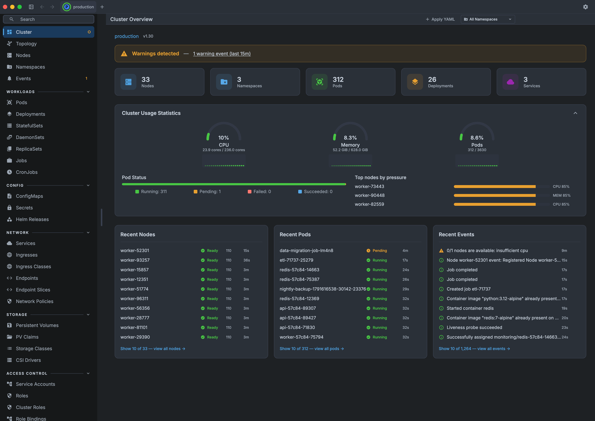
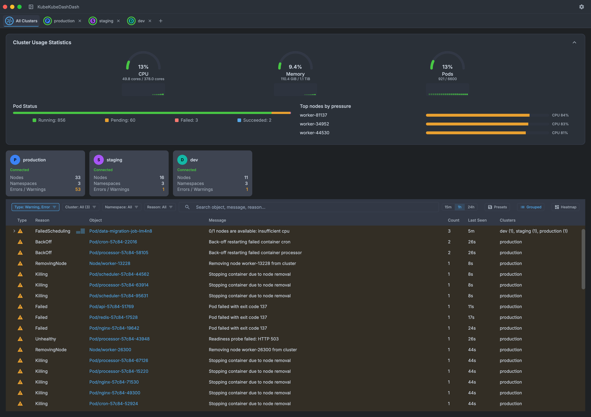
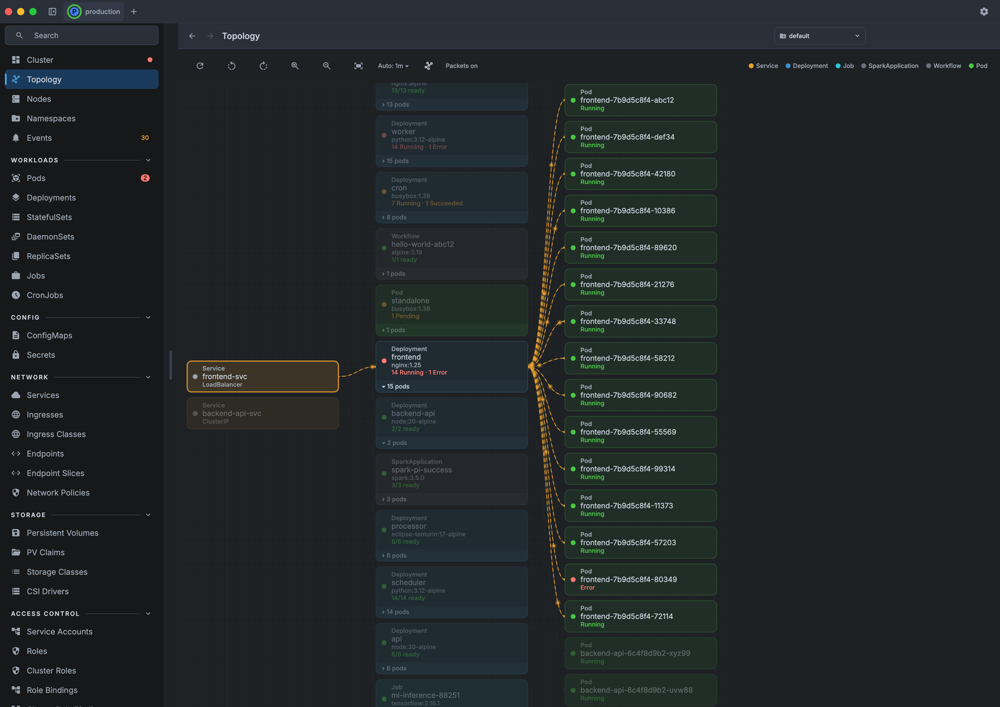

# KubeKubeDashDash

A desktop Kubernetes dashboard built with Compose Multiplatform. It connects to your clusters through your local kubeconfig and lets you browse resources — across several clusters at once — inspect YAML, edit a resource's YAML or apply manifests (with a diff and a server dry run first), stream logs, open an interactive shell into a pod, visualize cluster topology, and run common operational actions (scale, restart, cordon, drain, evict, trigger, approve…) without hand-writing kubectl commands.

It is mainly a browse-and-operate tool rather than an authoring tool. Edits to a resource's YAML go through a separate editor window with a line diff, a server-side dry run and a confirmation, and manifests are applied with server-side apply (see [Editing YAML and applying manifests](#editing-yaml-and-applying-manifests)); every other write is one of the targeted actions listed below.





## Features

### Cluster management

- Switch between kubeconfig contexts from the sidebar or the command palette
- Scope the namespaced views to one namespace, to several (tick their checkboxes, or Cmd/Ctrl-click a name), or to all namespaces
- **Cluster overview** — a health banner, five summary cards (nodes, namespaces, pods, deployments, services), CPU / memory / pod gauges with a short history, the pod status breakdown, the top nodes by pressure (with at least 3 nodes and a Metrics Server), and the most recent nodes, pods and events. With namespaces selected, a note says what follows them; nodes and capacity always cover the whole cluster
- A **default namespace** per cluster (Settings → Default namespace) is selected when a cluster connects fresh
- When a cluster drops, its screen stays in place under a **Connection lost** overlay that counts down to the next automatic retry, with **Retry now** and **Switch cluster…**
- A liveness probe detects silent disconnects and reflects connection state in the tab

### Multi-cluster workspaces

- **Tab strip** — each tab shows a color-coded cluster chip with a live connection-status ring: a rotating arc while connecting, a pulsing red ring when disconnected, and a solid ring when healthy
- **Multiple windows** — open additional OS windows, each running as an independent workspace with its own tab strip, navigation state, and selected namespace
- Tabs and windows are fully isolated — scrolling, selection, and navigation do not bleed across
- Per-cluster colors are assigned automatically and can be overridden in Settings

### All Clusters view

A dedicated tab (alongside your per-cluster tabs) that aggregates everything you have open into one screen:

- **Fleet strip** — a Total panel and, when node usage is known, the top nodes by pressure, with one panel per open cluster (in tab order) between them once two or more clusters are open. Each panel shows CPU, memory and pod usage and a pod-phase bar (hover for exact figures); the Total panel adds a short usage history. When the panels don't fit, the cluster panels scroll between the pinned Total and Top nodes
- **Warnings and navigation** — the warnings chip on the Total and cluster panels counts the Warning and Error events of the chosen time window and narrows the event table to them; click a cluster panel to open its tab (in this window or another), or a top node to open it in its cluster's tab
- **Event triage** — a filterable event stream spanning all clusters; filter by cluster, namespace, reason, and type, save and reapply filter presets, group related events, and toggle a reason **heatmap** across clusters (it opens by itself once per visit when, as the tab opens, three or more clusters have warnings of two or more reasons and the event table keeps enough room; close it and it stays closed until you open it yourself)

### Cluster topology

A whole-cluster graph that visualizes how resources relate, with workload cards, a dedicated pod column, and animated "packets" flowing along connections.



- Columns are pyramid-arranged by upstream connection count, and the viewport centers on the graph on landing
- Viewport controls: **zoom** in/out, **pan** (drag), **rotate** the flow direction through four orientations, and **reset** zoom and pan
- Click a node to highlight the entire connected pipe
- Configurable **auto-refresh** (Off / 5s / 15s / 30s / 1m / 2m / 5m, default 1m), paused automatically when you leave the screen
- Namespace selector, a dynamic legend of the kinds in view, and an optional packet-animation toggle
- Custom resources group their owned pods under the CRD root

### Resource browsing

Supported resource types:

| Category | Resources |
|----------|-----------|
| Cluster | Nodes, Namespaces, Events |
| Workloads | Pods, Deployments, StatefulSets, DaemonSets, ReplicaSets, Jobs, CronJobs |
| Config | ConfigMaps, Secrets, Helm Releases |
| Network | Services, Ingresses, IngressClasses, Endpoints, EndpointSlices, Network Policies |
| Storage | PersistentVolumes, PersistentVolumeClaims, StorageClasses, CSIDrivers |
| Access Control (RBAC) | ServiceAccounts, Roles, ClusterRoles, RoleBindings, ClusterRoleBindings, CertificateSigningRequests |
| Autoscaling & Disruption | HorizontalPodAutoscalers, PodDisruptionBudgets |
| Governance | ResourceQuotas, LimitRanges, PriorityClasses |
| Admission | ValidatingWebhookConfigurations, MutatingWebhookConfigurations |
| Custom | Any CRD discovered on the cluster (see below) |

Lists are sortable tables that refresh automatically (live via Kubernetes watch/informers where available, otherwise polled). They support keyboard navigation (arrow keys, Home/End to jump), show the full value on hover when a cell is truncated, format large counts with thousands separators, and — on the Pods screen — let you pin rows to the top. Click a header to sort; on the Pods and Nodes tables, Restarts, CPU, Memory and Age sort by value rather than as text. Use the header's ⋮ menu to show or hide columns or switch the table between Comfortable and Compact density.

With a Metrics Server installed, the Pods table shows each pod's CPU and memory use (hover for its requests and limits; memory turns orange from 80 % and red from 90 % of a container's limit), and the Nodes table's CPU and Memory columns show use against allocatable with a bar. Hide either column from the table's ⋮ menu.

### Custom resources (CRDs)

- CRDs are **discovered automatically** when you connect and listed in a dedicated **Custom Resources** sidebar section, searchable and grouped by API group
- **Per-cluster pin/hide** preferences persist across sessions (right-click a CRD to pin or hide it)
- Custom resources render through the same generic table and detail UI, appear in the command palette, and group under their owner in the topology graph

### Helm releases (read-only)

- **Helm Releases** (Config section) lists one row per release — its latest revision, whatever its status — with chart, app version, revision, status and when it was updated; it follows the namespace selector, the status filter and the search box
- The detail panel has an **Overview** (with the release's **NOTES**), **Values** (user-supplied, or computed the way `helm get values --all` prints them), **Manifest** (the YAML viewer, with search), **History** (every stored revision) and **Resources** (each object the chart rendered, opening its screen where it has one)
- Releases are read straight from Helm's own storage (Secrets, or ConfigMaps for `HELM_DRIVER=configmap`; Helm 3 and 4), so no `helm` binary is needed; it needs permission to list and watch Secrets, and says so plainly when it doesn't have it
- With Secret masking on, Values and NOTES stay hidden until you **Reveal** them, and the Manifest masks every Secret it renders (a document it can't check safely is hidden whole)
- It is a viewer only: there is no install, upgrade, rollback or uninstall

### Command palette (⌘K)

Press <kbd>⌘K</kbd> / <kbd>Ctrl+K</kbd> for a fuzzy finder (subsequence scoring) that jumps to any screen, switches between open clusters, or navigates to a namespace, a cached pod, a node, or a discovered CRD. A prefix narrows the search (`pod:`, `node:`, `ns:`, `dep:`, `crd:`, `go:`), and with an empty query a **Recent** group lists what you picked lately.

Type `>` for actions: pick a verb, then its target. The verbs are **Cordon / Uncordon node**, **Drain node**, **Scale…**, **Rollout restart**, **Evict pod**, **Force delete pod**, **Trigger now**, **Suspend / Resume** (CronJobs) and **Delete…**, and each one asks for confirmation. Esc, or Backspace in an empty query, backs out of a verb. The palette can also start a namespace's log tail or log capture (`Tail logs: <namespace>`, `Capture logs: <namespace>`) and open the **Apply YAML…** window.

### Resource details

- Side panel with **Overview** and **YAML** tabs for inspected resources; **Expand** widens it over the list, and Esc closes it
- The header labels its actions (e.g. **Scale**, **Rollout restart**, **Trigger now**, **Delete**); those that don't fit move into an **Actions** menu
- A **Related** section links pods, ReplicaSets, Deployments, StatefulSets, DaemonSets, Jobs and CronJobs to their owners and children (and a pod to its Services) — click one to open it — and a breadcrumb under the title shows the owner chain (e.g. `Deployment redis › ReplicaSet …`)
- YAML view with syntax highlighting, line numbers, selectable text, search (Enter / Shift+Enter step through the matches), copy-to-clipboard and an **Edit** button that opens the object in the YAML editor window (Events can't be edited)
- **Secret values are masked** in the YAML view by default (Settings → Privacy → Secret values): **Reveal** shows one Secret's decoded values, and with masking off **Decode** / **Raw** switch between decoded and base64 values. **Copy** always copies the raw YAML, base64 values included. The same setting hides Helm release values and NOTES until Reveal and masks Secrets in a release's manifest; there, Copy copies what is shown.
- Labels and annotations shown as chips; click a chip to toggle it into the active label/annotation filter
- Many kinds have resource-specific detail tabs — e.g. RBAC Roles show their resolved rules and bindings, ResourceQuotas show usage bars, EndpointSlices link through to their backing Service, and CertificateSigningRequests expose Approve/Deny

### Node details

- Detail panel with Overview, Pods, Events, and YAML tabs
- Lists pods scheduled on the selected node with click-to-navigate to the Pods screen
- Node events tab for warnings and errors
- Cluster-wide CPU/memory stats panel with usage-history sparklines
- **Cordon / Uncordon** and **Drain** actions (Drain cordons the node, then evicts only the pods actually scheduled on it, skipping DaemonSet-owned and static/mirror pods and already-terminated pods)

### Deployment details

- Resource graph tab that visualizes the ownership chain (Deployment → ReplicaSet → Pods) along with related Services, Ingresses, ConfigMaps, Secrets, and HPAs
- **Scale** and **Rollout restart** actions

### Pod details

- Overview, Events, and YAML views, with a container picker for multi-container pods
- **Events** tab listing the pod's own Kubernetes events, newest first, with a warning-count badge on the tab; click an event to jump to it on the Events screen
- A **warnings** section at the top of Overview with the newest three warnings, shown while the pod is unhealthy or a warning is still recurring (seen in the last 10 minutes); healthy pods keep a clean Overview
- Container cards say *why*: the waiting message, the exit code, and the previous run's end (e.g. `OOMKilled · exit 137`, finished 5m ago); a Pending pod shows the scheduler's reason, an evicted pod the eviction message
- CPU and memory usage gauges when a Metrics Server is installed
- One-click **Logs** (streamed into the bottom drawer) and **Terminal** (an interactive shell — see below)
- **Evict**, **Force delete**, and **Delete** actions

### Resource actions

Beyond browsing, KubeKubeDashDash can perform a focused set of write operations:

| Resource | Actions |
|----------|---------|
| Pods | Logs, Terminal (exec), Port forward, Evict, Force delete, Delete |
| Services | Port forward |
| Nodes | Cordon, Uncordon, Drain |
| Deployments, StatefulSets, ReplicaSets | Scale |
| Deployments, StatefulSets, DaemonSets | Rollout restart |
| CronJobs | Trigger now, Suspend, Resume |
| CertificateSigningRequests | Approve, Deny |
| Every kind with a YAML tab except Events, and custom resources | Edit YAML |
| Any resource, from a manifest | Apply YAML |
| Most other kinds + custom resources | Delete |

Delete is available both from a resource's detail-panel header and from a right-click context menu in the lists. Destructive actions go through a confirmation dialog. Editing a resource's YAML and applying manifests are described in [Editing YAML and applying manifests](#editing-yaml-and-applying-manifests).

A toast in the bottom-right corner confirms each action. Cordon / Uncordon, Scale and CronJob Suspend / Resume offer **Undo** in that toast for 10 seconds.

### Editing YAML and applying manifests

**Edit** (in a YAML tab) and **Edit YAML** (in a detail panel's header) open the object in a separate editor window; clicking again brings that window forward instead of opening a second one. The editor is a syntax-highlighted text area with line numbers, search, and undo / redo of your own typing. It hides the server-managed `status` and `metadata.managedFields`, and refuses a changed `apiVersion`, `kind`, name or namespace. Events and Helm releases can't be edited.

- **Review changes** (<kbd>⌘S</kbd> / <kbd>Ctrl+S</kbd>) shows a line diff of your edit and runs a server-side dry run of exactly what would be sent, so a rejection — a validation error, or a 403 for missing permission — shows up before anything is written. Only after a confirmation is the object replaced. The demo cluster has no dry run to ask, so there it is simulated locally and the review says so
- The replace is pinned to the resourceVersion you started from. If the object changed on the server while you were editing, a **changed on the server** banner offers **Compare with latest** and **Discard my edits**; nothing is overwritten, and a conflict at apply time applies nothing. A change to `status` alone is picked up silently
- **Secrets**: with masking on (Settings → Privacy → Secret values), editing a Secret first asks before showing its values, base64-encoded as in `kubectl edit`; the review's diff stays masked until **Reveal**, and a masked placeholder in the text is never sent to the cluster
- There is no **Undo** for an applied edit — Kubernetes keeps none, and re-applying the old version could undo someone else's change — so the confirmation says so. To change it back, edit it again
- **Unsaved edits are protected**: closing the editor window, closing its cluster tab or the main window, switching the tab to another cluster, and <kbd>⌘Q</kbd> on macOS each ask before discarding. Esc and moving around the main window leave an open editor alone, and editors are not part of a restored session
- **Apply YAML** (the header button, or **Apply YAML…** in the palette) opens a window for pasting or opening (**Open file…**: `.yaml`, `.yml` or `.json`, up to 5 MB) one or more manifests — several documents separated by `---`, or a `kind: List`. **Review** dry-runs every document and lists what each would do (created, configured, unchanged, or an error such as an unknown kind); **Apply** is enabled once every document passed and at least one would change something. Documents are applied in order with server-side apply as field manager `kubekubedashdash`, never forced, so a field another manager owns is reported as an error on its row. A failure doesn't stop the rest and **nothing is rolled back**: documents applied before it stay applied. A namespaced document without a namespace gets the namespace selected in the tab (when exactly one is), else `default`; server-owned fields such as `status` and `resourceVersion` are dropped from each document. On the demo cluster the dry run and the apply are simulated locally

The embedded MCP server is unchanged: it can only query, never write.

### Bulk actions

Select several rows and a bar above the table offers actions for all of them: tick their checkboxes (Shift-click one to extend a range), Cmd/Ctrl-click a row to toggle it, or press <kbd>⌘A</kbd> / <kbd>Ctrl+A</kbd> for all.

| Screen | Bulk actions |
|--------|--------------|
| Pods | Tail logs, Evict, Delete |
| Deployments | Restart, Delete |
| Nodes | Cordon, Uncordon, Drain |
| Other kinds except Namespaces, Services and Events, custom resources included | Delete |

Every bulk action except Tail logs asks for confirmation, can be stopped while it runs, lists what failed, and keeps the failed rows selected so you can retry. **Tail logs** streams the selected pods into one merged, colour-coded tab (up to 10 namespaces and 40 container streams at once); a single pod opens its own log tab.

### Pod shell (terminal)

Open an interactive shell into a running container via `kubectl exec` (powered by JediTerm). The shell auto-selects `bash`, falling back to `sh`. The session — including its scrollback — **persists across tab switches**, so navigating away and back does not drop your shell.

### Port forwarding

Forward a local port to a pod or a service — **Port forward** in a pod's or service's detail header, or **Port forward…** in its row menu. The dialog offers the ports the pod or service declares and suggests a local port (80 → 8080, 443 → 8443; leave it empty for a random free port).

- Listens on **127.0.0.1 only** — never on your network interfaces. Use the address as shown (`127.0.0.1:<port>`): IPv6 `::1` is not bound, so a client that resolves `localhost` to `::1` without falling back will be refused
- A service forward goes through one ready pod behind the service, resolving named target ports; if that pod goes away, the first connection after it fails and the following one picks another ready pod
- Running forwards are listed in the bottom drawer's **Port forwards** tab (open in browser, copy the address, stop), across every cluster and window
- A forward survives reconnects of its cluster, stops when its tab closes or switches to another cluster, and is not restored on the next launch
- Needs `create` on `pods/portforward` in the namespace

### Logs

Pod and application logs share a resizable **bottom drawer**, toggled with <kbd>⌘J</kbd> / <kbd>Ctrl+J</kbd>. Settings → Appearance → **Log panel beside sidebar** opens it to the right of a full-height sidebar instead of across the whole window (off by default).

- One tab per streamed pod/container; Jobs stream their pods' logs too (**Logs** in a Job's header, **View logs** in its row menu). The app's own log opens as an **Application logs** tab from Settings → Diagnostics
- Per-tab **filter** with the matches highlighted: plain text or a regular expression (`.*`), case-sensitive on request (`Aa`)
- In a pod tab, **Follow** keeps the newest line in view, **Wrap** wraps long lines, **Timestamps** prefixes each line with its Kubernetes timestamp, **Prev** shows the previous (crashed) container's log, **Since** limits the history (5m to 24h), and a container picker switches between a pod's containers
- Selectable, copyable text (drag to select, ⌘/Ctrl+C), plus buttons to copy the visible lines or save them to a file
- A pod tab keeps the newest 5,000 lines (a namespace or multi-pod tail 20,000) and says how many older lines it dropped
- Logs for terminated pods (Succeeded/Failed) are read once as history instead of opening a live stream
- Hide the drawer (**Hide log drawer**) and its tabs stay open (a title-bar chip counts them; click it or press <kbd>⌘J</kbd> to bring them back). **Close all (N)** closes every tab — except Port forwards while a forward runs — and offers **Undo** for 10 seconds (it asks first while a log capture is still running)

**Namespace tail.** **Tail all pods…** in a namespace's row menu (or `Tail logs: <namespace>` in the palette) streams a stern-style merged tail of the namespace: one colour per workload, new and restarted pods attach on their own, and up to 40 container streams run at once. One tail runs per cluster tab. To tail exactly the pods you choose, select them on the Pods screen and use **Tail logs** (see [Bulk actions](#bulk-actions)); a crash-looping container then also shows the output of its last crashed run.

**Log capture.** **Capture logs…** in a namespace's row menu (or `Capture logs: <namespace>` in the palette) saves the logs of every container in the namespace — init, main and ephemeral, optionally with the previous runs of restarted ones — for a time window you pick. It writes a folder (`<namespace>-logs-<date>-<time>/<pod>/<container>.log` plus `capture-summary.txt`), in your Downloads folder by default. Cancelling keeps what was already saved.

### Filtering & search

- **Status filter** — multi-select menu (with All / None) on the Pods, Nodes, and generic resource lists
- **Labels** and **Annotations** pickers list the `key = value` pairs in view with their counts — search them and click one to filter — or take comma-separated `key=value` pairs typed by hand; the selection is shared across screens
- Click a label/annotation chip in a detail panel to toggle it into the filter
- Every active filter shows as a removable pill above the table (Nodes add **Under pressure**, Deployments **Degraded only**), and a single **Clear** chip resets them all
- Per-screen text search across the relevant fields; <kbd>⌘F</kbd> / <kbd>Ctrl+F</kbd> focuses it
- The Pods screen opens with a summary strip (pods, failing, pending, CPU, memory); click **failing** or **pending** to show only those pods

### Startup prerequisites check

On launch the application verifies that the required tools are available before presenting the cluster selector:

- **Kubeconfig** — checks that `~/.kube/config` (or `$KUBECONFIG`) exists and is readable
- **Cluster contexts** — ensures at least one context is defined
- **Cloud CLI tools** — checks for `aws`, `gcloud` (with `gke-gcloud-auth-plugin`), or `kubelogin`/`az` only when the kubeconfig contains EKS, GKE, or AKS contexts respectively

CLIs are re-scanned on each check, so a retry after installing a missing tool succeeds without restarting. If all checks pass the modal is dismissed automatically. If any required check fails, you can quit, ignore the warning and continue, or run **cluster discovery** (EKS or GKE) to populate the kubeconfig without leaving the app. When no kubeconfig contexts exist at all, the app shows a dedicated first-run welcome screen.

### Cluster discovery (EKS and GKE)

Built-in wizards find EKS and GKE clusters and add them to your kubeconfig. They are available from:

- The system check / welcome screen when no kubeconfig is found
- The cluster selector
- The **Settings** dialog → Cluster discovery → AWS EKS or Google Cloud GKE, at any time

**EKS.** Pick one or more AWS profiles, choose a region scope (default region only, common regions, or all enabled regions), and select which clusters to import; results are grouped by profile. Each import calls `aws eks update-kubeconfig --profile <name>`, which embeds `AWS_PROFILE` into the kubeconfig user exec block — so the profile binding travels with the cluster entry and `aws eks get-token` always uses the right profile at connection time. The bound profile is shown in the cluster selector for every EKS context. Requires the AWS CLI v2 on `PATH`.

**GKE.** Using your active `gcloud` account, choose GCP projects, let the wizard scan them, and pick the clusters to import. Each import runs `gcloud container clusters get-credentials <name> --location=<location> --project=<project>`. Requires the Google Cloud SDK with `gke-gcloud-auth-plugin`.

**Enter by name.** For an account that can read a cluster but cannot list clusters or projects, the **Enter by name** tab on the first step imports one cluster directly: AWS profile, region and cluster name for EKS; project ID, location and cluster name for GKE — or paste an `update-kubeconfig` / `get-credentials` command, a cluster ARN or a context name.

If `~/.kube/config` does not exist, the directory and file are created on demand; an existing config is backed up before clusters are imported.

### Settings

Settings are opened via the gear icon (⚙) in the title bar or <kbd>⌘,</kbd> / <kbd>Ctrl+,</kbd>:

- **Appearance** — Light, Dark, or System (follows OS) theme
- **Style** — Default or Retro (pixel headings, a retro terminal font, squared corners; CRT power-on effects)
- **Palette** — the style's own colours, High contrast (AAA text, thicker outlines and focus ring), Monochrome, or an editor palette: Solarized, Gruvbox, Catppuccin, Nord or Dracula
- **Colour-blind-safe status colours** — blue / gold / crimson status colours for every palette, tuned against protanopia, deuteranopia and tritanopia simulations
- **CRT scanlines** — optional faint scanlines and darkened corners in the Retro style (off by default; does not cover dialogs, menus, tooltips or the terminal)
- **CRT refresh bar** — with scanlines on, a bright line that sweeps down the window: Off (default), Once after each CRT power-on, or Rolling every 8 s (paused while the window is in the background unless you keep it rolling)
- **UI zoom** — 80 %, 100 %, 125 % or 150 % (also <kbd>⌘+</kbd> / <kbd>⌘-</kbd> / <kbd>⌘0</kbd>)
- **Density** — Comfortable or Compact spacing across the app (rows, headers, panels, palette); text size is unchanged
- **Log panel beside sidebar** — a widescreen layout: the sidebar keeps its full height and the log panel opens to its right (off by default)
- **Cluster colors** — override the auto-assigned color for any cluster, from a preset palette or a custom color
- **Default namespace** — the namespace a cluster opens in when it connects fresh
- **Tab behavior** — when closing the active tab, focus the left neighbor, the first tab, or the most-recently-visited tab; choose whether the tab strip shows always or only with multiple tabs; and **Restore last session** (on by default) reopens the windows, clusters, namespaces and screens you had when you last quit
- **Live data → Topology auto-refresh** — how often the topology graph re-fetches (lists and detail panels update live)
- **Keyboard shortcuts** — the shortcut sheet, also on <kbd>⌘/</kbd> / <kbd>Ctrl+/</kbd>
- **Privacy → Secret values** — mask Secret data in the YAML view (the default) or show it in clear
- **Integrations → MCP Server** — enable/disable the embedded MCP server, set its port (default 3001), restrict it to localhost, require authentication, and copy the generated bearer token
- **Cluster discovery** — AWS EKS and Google Cloud GKE wizards
- **Demo cluster simulator** — pause/resume, adjust node and pod count ranges, reset to baseline, or stop the simulator
- **Diagnostics** — open the application log in the bottom drawer, and **Preferences storage**, which says whether settings were read and saved correctly
- **About** — version and app details

A search box at the top finds any setting by name or keyword (e.g. "zoom", "token", "scanlines") and jumps to it.

### MCP server

KubeKubeDashDash embeds an opt-in [Model Context Protocol](https://modelcontextprotocol.io) server so AI assistants and other MCP clients can query your clusters **read-only** over Server-Sent Events (Ktor, default port 3001). Enable it under Settings → Integrations.

- **Resources** — `cluster/overview` and `resource-usage` summaries
- **Tools** — `list_clusters`, `list_resources`, `get_resource_yaml`, and `get_pod_logs`; each can target a specific kube-context when multiple clusters are open
- **Hardening** — binds to localhost by default; optional bearer-token auth (a fresh token each start, compared in constant time); authentication is forced on whenever you bind to the LAN; Origin/Host checks guard against CSRF; and a kind allowlist keeps Secret, ConfigMap, and Node contents out of `get_resource_yaml`

### UI

- Light, Dark, and System (follows OS) themes (Material 3)
- Retro style (opt-in) — pixel headings, a retro terminal font for text and code, squared corners, and CRT power-on / channel-cut motion in both its dark and light variants; optional scanline overlay
- High contrast, Monochrome and five editor palettes (Solarized, Gruvbox, Catppuccin, Nord, Dracula), orthogonal to the Default/Retro style
- Bundled **Inter**, **JetBrains Mono**, **Sixtyfour** (retro headings) and **Departure Mono** (retro text) fonts for consistent rendering across platforms
- Status badges paired with a glyph so state is legible without relying on color; optional colour-blind-safe status colours
- Status is never colour alone: glyphs, filled vs hollow dots, dashed rings and usage-tier icons
- **Sidebar** — a search box filters it (aliases such as `pv`, `pvc` and `csr` work, and CRDs match on kind, plural, group or short name); right-click a row to add it to **Favourites**; less common kinds sit under **More**; badges count failing pods, NotReady nodes and recent warning events, and clicking one opens the pre-filtered list
- Collapsible sidebar — toggle from the title bar; collapsed, it becomes an icon rail where More and Custom Resources open as menus; state is persisted across sessions
- **Back / Forward** in each cluster tab's header (<kbd>⌘[</kbd> / <kbd>⌘]</kbd>, <kbd>Ctrl+[</kbd> / <kbd>Ctrl+]</kbd>) step through the screens and detail panels you visited
- **Session restore** (on by default) — the next launch reopens your windows with their size and position, cluster tabs, namespaces and screens
- Toasts confirm actions, with **Undo** where it applies
- **UI zoom** (80–150 %) and a keyboard shortcut sheet (<kbd>⌘/</kbd> / <kbd>Ctrl+/</kbd>)
- macOS window tiling — supports half-screen and other Sonoma tiling arrangements
- Resizable detail panels and a resizable logs drawer; widths/heights persist across tab switches
- Cross-resource navigation (e.g. node → pod) and themed right-click context menus

## Installing

Installers for macOS (Apple Silicon), Windows and Linux (amd64 `.deb`) are on the [latest release](https://github.com/beytullah-gunduz/kubekubedashdash/releases/latest).

On an Apple Silicon Mac you can install it with [Homebrew](https://brew.sh) instead, and `brew upgrade` then keeps it up to date:

```bash
brew install --cask beytullah-gunduz/tap/kubekubedashdash
```

Keep the `beytullah-gunduz/tap/` prefix: Homebrew trusts a third-party cask only when you name it in full. If you installed the DMG before, delete `/Applications/KubeKubeDashDash.app` first, because Homebrew won't replace it. Your settings are kept.

The app isn't notarized yet, so macOS blocks its first launch, and again after each Homebrew upgrade. Open it once, then click **Open Anyway** in System Settings → Privacy & Security.

## Prerequisites

- **JDK 17** or later to start the Gradle wrapper (only for building from source; the packaged DMG/MSI/DEB bundles its own JVM). The build itself runs on **Temurin 21**, pinned in `gradle/gradle-daemon-jvm.properties`: Gradle uses an installed Temurin 21, or downloads one on macOS and Windows. On Linux, install Temurin 21 yourself.
- A valid `~/.kube/config` with at least one accessible cluster
- **AWS CLI** — required when connecting to EKS clusters (`aws eks get-token`)
- **Google Cloud SDK** — required when connecting to GKE clusters
- **Azure kubelogin** or **Azure CLI** — required when connecting to AKS clusters
- **Metrics Server** (optional) — required for CPU/memory usage data on the Pods and Nodes screens

The application checks for these at startup and reports any missing prerequisites.

## Demo cluster

If you don't have a Kubernetes cluster handy, the application ships with a built-in demo cluster simulator. Select **Demo Cluster** in the cluster picker to explore every screen with synthetic resources — nodes, pods, deployments, jobs, seeded CRDs (e.g. Spark and Argo), a few made-up Helm releases (one with a failed upgrade in its history, one mid-upgrade, one stored in ConfigMaps), live-updating metrics, and a steady trickle of events. Each Demo Cluster pick gets its own independent mock instance, and the simulator can be paused, scaled, reset, and stopped from Settings → Demo cluster simulator.

## Keyboard shortcuts

| Shortcut | Action |
|----------|--------|
| <kbd>⌘K</kbd> / <kbd>Ctrl+K</kbd> | Open the command palette |
| <kbd>⌘/</kbd> / <kbd>Ctrl+/</kbd> | Show the shortcut sheet (it also lists the shortcuts for tables, the palette, YAML search, the YAML editor window and dialogs) |
| <kbd>⌘,</kbd> / <kbd>Ctrl+,</kbd> | Open Settings |
| <kbd>⌘J</kbd> / <kbd>Ctrl+J</kbd> | Toggle the logs drawer |
| <kbd>⌘F</kbd> / <kbd>Ctrl+F</kbd> | Focus the list filter |
| <kbd>⌘[</kbd> / <kbd>Ctrl+[</kbd> | Back |
| <kbd>⌘]</kbd> / <kbd>Ctrl+]</kbd> | Forward |
| <kbd>⌘+</kbd> / <kbd>⌘-</kbd> (<kbd>Ctrl++</kbd> / <kbd>Ctrl+-</kbd>) | Zoom in / out |
| <kbd>⌘0</kbd> / <kbd>Ctrl+0</kbd> | Reset zoom |
| <kbd>Esc</kbd> | Close the detail panel |
| <kbd>⌘A</kbd> / <kbd>Ctrl+A</kbd> | Select all rows in a table with bulk actions |
| <kbd>⌘S</kbd> / <kbd>Ctrl+S</kbd> | Review changes (in a YAML editor window) |

## Running

```bash
./gradlew :composeApp:run
```

The application opens a 1440×960 window on first launch (later launches restore the last window size and position while **Restore last session** is on), runs a prerequisites check, and presents the cluster selector.

## Building distributable packages

```bash
# macOS
./gradlew :composeApp:packageDmg

# Windows
./gradlew :composeApp:packageMsi

# Linux
./gradlew :composeApp:packageDeb
```

## Tech stack

| Component | Library / Version |
|-----------|-------------------|
| Language | Kotlin 2.4.20 |
| UI framework | Compose Multiplatform 1.12.1 |
| Material 3 | compose-material3 1.12.0-alpha03, material3-adaptive 1.3.0-rc01 (ListDetailPaneScaffold) |
| ViewModel / lifecycle | androidx.lifecycle 2.11.0 (multiplatform) |
| Persistence | androidx.datastore-preferences 1.2.1 |
| Kubernetes client | fabric8 kubernetes-client + kubernetes-server-mock 7.7.0 |
| Terminal | JediTerm 3.76 (interactive pod exec) |
| YAML editor | RSyntaxTextArea 4.0.1, BSD-3-Clause (the separate YAML editor window) |
| Coroutines | kotlinx-coroutines 1.11.0 (core + swing) |
| Serialization | kotlinx-serialization 1.11.0 |
| JSONPath | json-path 3.0.0 (custom-resource column extraction) |
| MCP server | modelcontextprotocol kotlin-sdk 0.15.0 |
| Embedded HTTP server | Ktor 3.6.0 (CIO + SSE + content negotiation) |
| Native interop | JNA 5.19.1 (macOS shell `PATH` resolution) |
| Logging | Logback Classic 1.6.3 (via SLF4J) |
| Code formatting | Spotless 8.10.2 + ktlint |
| Build tool | Gradle 9.7.1, Temurin 21 (daemon JVM criteria) |
| Screenshot generation | `./gradlew generateScreenshots` — drives the live app against the demo cluster via `WorkspaceManager` and captures each window's own Skia frame in-process (no Screen Recording permission); `scripts/site_images.py` then crops and converts the captures for the site and this README |

## CI

Every push and PR to `main` checks formatting, compiles, runs the desktop test suite and verifies the release build on Linux. Pushing a `v*` tag runs the same checks on macOS, Linux and Windows, builds the installers (DMG, DEB, MSI) and creates a GitHub Release with them. For a stable tag it then points the Homebrew cask at the new DMG (see [packaging/homebrew](packaging/homebrew/README.md)).

The installers ship ProGuard-shrunk jars, which no unit test runs. `verifyReleaseBuild` checks them: a bytecode scan fails on any `invokespecial` of an interface method through an indirect superinterface (the JVM verifier rejects those at class load), and a headless canary boots the shrunk jars — logging, JSONPath, JediTerm, the YAML editor engine and RSyntaxTextArea, the demo cluster and a full MCP session — once on the full JDK and once limited to the packaged runtime's modules. It runs in a scratch sandbox and never reads your kubeconfig, preferences or logs:

```bash
./gradlew :composeApp:verifyReleaseBuild
```

## macOS packaged app notes

When launched from a DMG-installed `.app` bundle, macOS GUI apps inherit a minimal `PATH` that does not include user-installed tools. KubeKubeDashDash automatically resolves the full `PATH` from the user's login shell at startup and injects it into the JVM environment so that kubeconfig exec plugins (e.g. `aws eks get-token`) work correctly.

## Limitations

- Desktop only (no web or mobile targets)
- Little RBAC-aware UI — apart from the Helm releases view, errors from insufficient permissions are shown as-is (the YAML editor shows the API's 403 at review time, before anything is written)
- Helm support is read-only: no install, upgrade, rollback or uninstall, and hooks are not shown
- No Undo for an applied YAML edit or manifest, and Apply YAML never rolls back documents applied before a failure
- The unsaved-edits prompt on quit (<kbd>⌘Q</kbd>) is macOS-only; on other platforms closing an editor, a tab or a window still asks
- The demo cluster simulates dry runs and server-side apply locally, so it shows the flow but not what a real API server would answer
- Metrics require a running Metrics Server in the cluster
- Log streaming relies on fabric8's `watchLog` and may not handle all edge cases (e.g., very large log volumes)

## Colour palette credits

The editor palettes are adapted from their public specifications. Colours whose contrast fell below WCAG AA
were lightness-adjusted, so they are not official ports.

- **Solarized** — Ethan Schoonover, MIT — https://github.com/altercation/solarized
- **Gruvbox** — Pavel Pertsev (morhetz), MIT/X11 — https://github.com/morhetz/gruvbox
- **Catppuccin** (Mocha, Latte) — Catppuccin, MIT — https://github.com/catppuccin/palette
- **Nord** — Sven Greb, MIT — https://github.com/nordtheme/nord (the light variant is kkdd's own, built from Nord's Snow Storm colours)
- **Dracula / Alucard** — Dracula Theme, MIT — https://github.com/dracula/dracula-theme

## License

MIT
